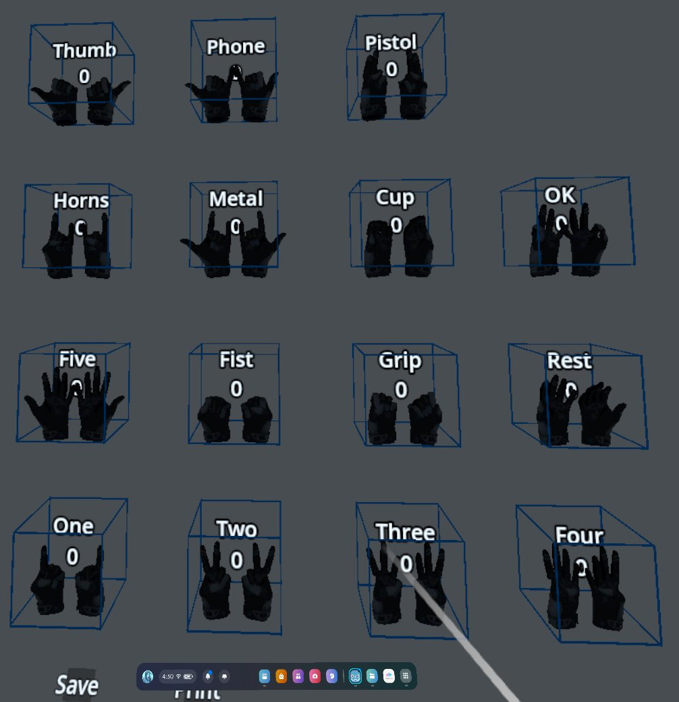

# Godot XR Handtracking toolkit

## GENERAL INFORMATION

- Latest tested Godot version: v4.2.1.stable.official.b09f793f5
- Tested headset: Meta Quest 2

You can find the example scene in example/example.tscn

This is a stripped-down version of a full game.
You can find it here:
<https://github.com/RevolNoom/Galaxy-Warrior-Training>

## WHAT THIS TOOLKIT PROVIDES

### **Modules to work with hand poses:**

- PoseRecordingRoom: Create your own templates of hand poses as JSON, and use them for recognization.

 

- HandPoseMatcher: Match tracked-hand pose to a pose from JSON templates in realtime.

### **Module for object picking:**

- XRPickArea: Defines where object can be picked and what hand pose allows picking.

- XRHandSnap: Helps snapping object's transform to hand's when object is picked.

- XRPickupFunction: Attach to OpenXRHand's Skeleton. Supports 3 pickup modes:

  - *On pose change*: Change your hand pose to one of XRPickupArea pickup poses to pick up object. Useful for grabbing gesture.

- *On touch*: Touches the XRPickArea and hand pose is one of touch-pick poses, the object gets picked up.
  
- *Ranged pickup*: Work like *On pose change*, but use Raycast.  

- XRPickableRigidBody: Defines picked-up behaviors. You can customize its picked-up movement here to fit your needs.

## WHAT THIS TOOLKIT LACKS

- Pickup doesn't work with controllers.
- Closest-object highlighting.
- Good physics for hand.

## CREDITS

**3D assets licensed under Creative Commons Attribution:**
- JoeLudwig's hand model: https://github.com/JoeLudwig/xrsandbox/tree/master/projects/xrsandbox/assets/models/valve_hand_models
- "DC-15" - KO71K

**Sound effects:** Pixabay

Ideas and implementations inspired by these two awesome Godot XR toolkits:

- <https://github.com/patrykkalinowski/godot-xr-kit>
- <https://github.com/GodotVR/godot-xr-tools>
